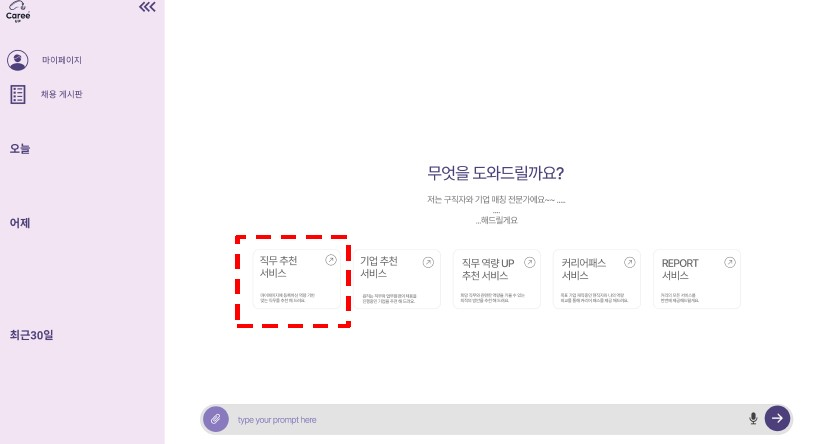
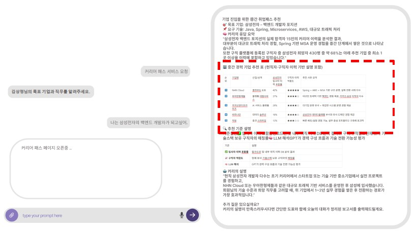
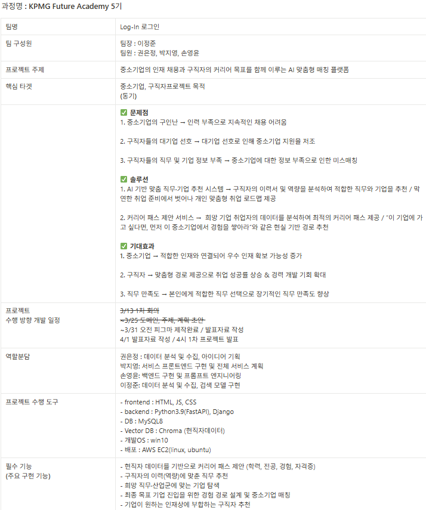
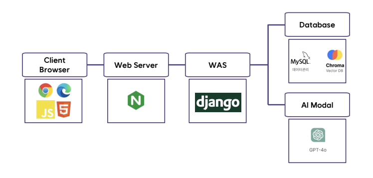
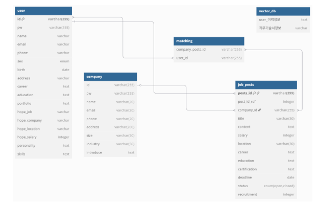
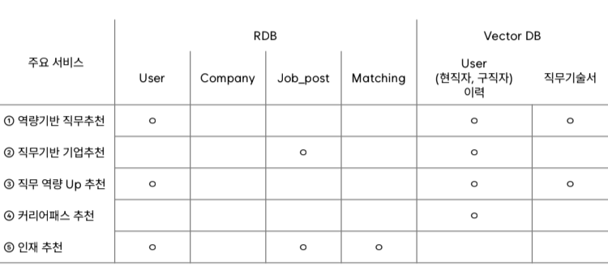
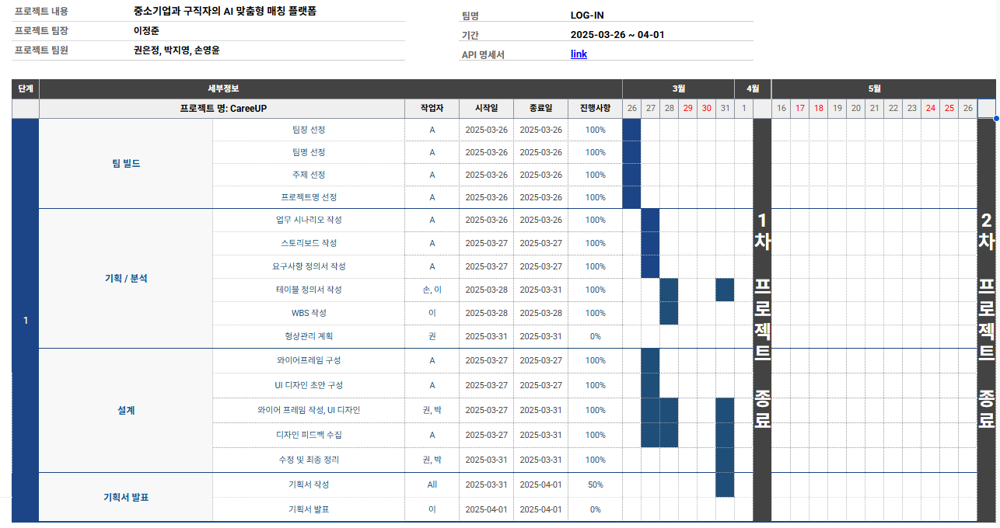

# fa05-1st-Login
KPMG_future_academy05_login 첫 번째 프로젝트

-----------------

# 프로젝트 기획서

## 1. 프로젝트 개요
### 1. 프로젝트 주제: **중소기업과 구직자의 Matching 플랫폼**
### 2. 프로젝트 목표: AI 기반으로 구직자와 중소기업의 맞춤형 매칭 제공
### 3. 주요 기능
- 역량기반 직무추천
- 직무기반 기업추천
- 직무역량 확보방안
- 유망 중소기업 추천
- 기업 인채추천 및 Direct Job Offering
- 커리어패스 리포트

## 2. 프로젝트 일정
![프로젝트 일정]
| 작업 항목                  | 시작 날짜   | 종료 날짜   | 기간(일) |
|---------------------------|------------|------------|---------|
| Kickoff meeting           | 2025-03-13 | 2025-03-13 | 1       |
| 프로젝트 주제선정            | 2025-03-17 | 2025-03-20 | 4       |
| 프로젝트 구체화 및 계획서 작성 | 2025-03-25 | 2025-03-26 | 2       |
| 요구사항 정의서 및 WBS 작성   | 2025-03-27 | 2024-03-28 | 2       |
| 피그마 작업                 | 2025-03-31 | 2025-03-31 | 1       |
| 최종 검토 및 프로젝트 발표    | 2025-04-01 | 2025-04-01 | 1       |

## 3. 시각적 자료

# 요구사항 정의서

## 1. 사용자 요구사항
- [ ] 직무/기업 추천 버튼: [구직자의 역량에 맞는 직무/기업 추천 제공]
- [ ] 채팅: [LLM + RAG 기반으로, 사용자 질문에 대해 정확하고 개인화된 응답 제공]
- [ ] 인재 탐색 버튼: [인재 정보 입력 및 추천]
- [ ] 개인 마이페이지: [이력서관리, 지원현황, 관심기업, 알림/대화/AI 상담 시스템]

## 2. 기능 요구사항
- [ ] AI 추천 시스템: RAG 적용된 AI 활용
- [ ] C-U 톡: 구직자와 기업간 메신저
- [ ] 챗봇 내 양식 입력창: 나이, 학력, 전공, 자격증, 기타 등 양식화 된 입력창 표출

# 프로젝트 설계서
## 1. 시스템 아키텍쳐

## 2. ERD 계획서

## 3. 1차 WBS

# 발표 자료
## 📄 PDF Report
[Download PDF](Login_Phase1_Presentation.pdf.pdf)

# 1차 프로젝트 회고

## 1. 문제점
- 소통의 어려움
- PM역할의 부재
- 이전 작업물에 대한 이해 → 확정안 게시 필요
- 너무 트러블이 없었다! → 상대방에 대한 배려/ 소통방식
- 구체화된 결과물이 없다보니 서로 같은 문제에 대한 이해부족
- 결단력 업업업! ⇒ 시간단축 가능! ⇒ 결단력을 높일 수 있는 회의방안(논의방안) 필요!

## 2. 좋은점
- 출력물 퀄리티 괜찮음

